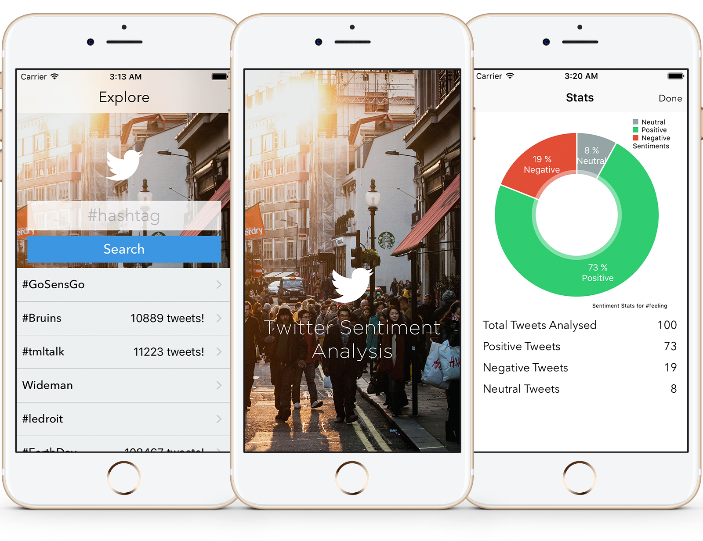

<h3 align="center">
  
</h3>

<h1 align="center">
Twitter Sentiment Analysis iOS App
</h1>

This application was developed to use natural language processing to analyse the overall sentiment of tweets and visualise the results in real-time on a per topic basis, packaged in a user-friendly mobile application, allowing for smarter, data-driven decision making for   business,   marketing   and   political   purposes.

Report.pdf: Project report covering research, analysis, implementation and performance.

Presentation.pdf: Project presentation

Acknowledgments: Contains the list of open source software used for developing both the client and the server.

Features:
- Every search fetches up to 100 mixed tweets (latest + popular).
- Refreshing and/or searching again fetches up to 100 newer tweets.
- Displays relevant tweets and their sentiment score.
- Tap tweet to view sentiment score details.
- Tap on "Stats" to view a graph of aggregated sentiments for all relevant tweets seached.

Todo:
- Add feature to allow real-time twitter streaming by using the streaming API.

Server
======

The "Server" directory contains the sentiment analysis and API Express server files.

It is preferable to have the server running before the iOS client. An instance of MongoDB needs to be running as the server will create a database named "tsapi" in order to save data.

Usage:
- Open the directory in the terminal and perform "npm install" to install all dependencies.
- Update your Twitter API secret and key in config/twitter.js
- Run "npm start" to run the server.
- The server will be running on http://localhost:3000
 
Client
======

The "Client" directory contains the iOS client side application project files

Usage:
- Please open the TwitterSentiment.xcworkspace file to open the workspace in Xcode
- Run "pod install" to install all dependencies (CocoaPods gem required)
- Developed using Xcode 8.2.1, tested on simulator running iOS 10.2
- Tested using latest Xcode 9.0.1
- Better viewed on iPhone 7 or iPhone SE.

> This project is in no way affiliated with Twitter Inc. The Twitter name and logo are registered trademarks of Twitter Inc. This is an educational project and is open source under the MIT license.